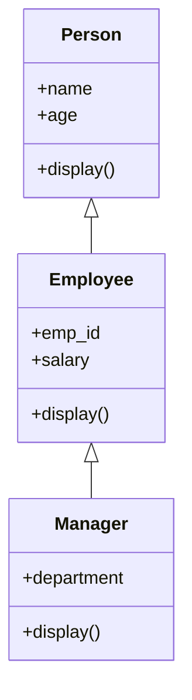
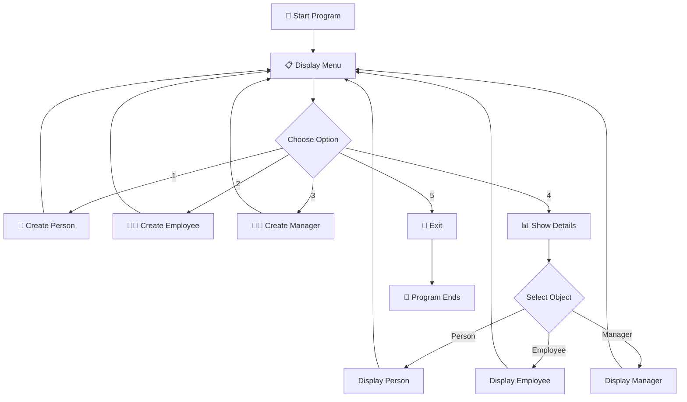

# Oppwrapper
# 👨‍💼 Employee Management System

<p align="center">

# 🚀 Python OOP Employee Management System

### A Console-Based Employee Management System Built with Object-Oriented Programming

**Person → Employee → Manager**

</p>

<p align="center">


</p>

---

## 🧑‍💻 Project Overview

**Employee Management System** is a beginner-friendly Python console application created to demonstrate the fundamentals of **Object-Oriented Programming (OOP)**.

The project uses **three classes**:

```text
Person
   ↓
Employee
   ↓
Manager
```

Each class inherits properties and methods from the previous class.

The application allows users to create and display information about:

* 👤 Person
* 👨‍💼 Employee
* 👨‍💼 Manager

---

# ✨ Why This Project?

This project demonstrates how real-world entities can be represented using Python classes.

For example:

```text
Person
 ├── Name
 └── Age

Employee
 ├── Name
 ├── Age
 ├── Employee ID
 └── Salary

Manager
 ├── Name
 ├── Age
 ├── Employee ID
 ├── Salary
 └── Department
```

This makes the project an excellent example of **Inheritance in Python**.

---

# 🖼️ Project Preview

<p align="center">


</p>

> 📌 Replace this placeholder with a screenshot of your actual terminal application.

---

# ⭐ Features

| Feature                   | Description                            |
| ------------------------- | -------------------------------------- |
| 👤 Create Person          | Create a person using name and age     |
| 👨‍💼 Create Employee     | Create employee with ID and salary     |
| 👨‍💼 Create Manager      | Create manager with department details |
| 📋 Show Details           | Display stored information             |
| 🔁 Inheritance            | Employee inherits from Person          |
| 🧬 Multilevel Inheritance | Manager inherits from Employee         |
| 🖥️ CLI Menu              | Easy terminal-based interface          |
| 🚪 Exit System            | Safely exit the application            |

---

# 🧬 OOP Inheritance Structure

The most important part of this project is **multilevel inheritance**.



### In simple words:

```text
Person
  ↓
Employee gets everything from Person
  ↓
Manager gets everything from Employee
```

Therefore:

```text
Manager
   ↓
Employee
   ↓
Person
```

---

# 🧠 OOP Concepts Used

## 1️⃣ Class

The project contains three classes:

```python
class Person:
```

```python
class Employee(Person):
```

```python
class Manager(Employee):
```

---

## 2️⃣ Object

Objects are created from the classes:

```python
person = Person(name, age)
```

```python
employee = Employee(name, age, emp_id, salary)
```

```python
manager = Manager(name, age, emp_id, salary, dept)
```

---

## 3️⃣ Inheritance

Employee inherits from Person:

```python
class Employee(Person):
```

Manager inherits from Employee:

```python
class Manager(Employee):
```

This creates:

```text
Person
  ↓
Employee
  ↓
Manager
```

---

## 4️⃣ Constructor

The `__init__()` method initializes object data.

Example:

```python
def __init__(self, name, age):
    self.name = name
    self.age = age
```

---

## 5️⃣ Method Overriding

Each class has its own `display()` method.

For example:

```python
def display(self):
```

The child classes extend the display functionality of their parent classes.

---

# 🏗️ Class Architecture

```text
                 ┌──────────────────┐
                 │      PERSON      │
                 ├──────────────────┤
                 │ name             │
                 │ age              │
                 ├──────────────────┤
                 │ display()        │
                 └────────┬─────────┘
                          │
                          ▼
                 ┌──────────────────┐
                 │    EMPLOYEE      │
                 ├──────────────────┤
                 │ employee_id      │
                 │ salary           │
                 ├──────────────────┤
                 │ display()        │
                 └────────┬─────────┘
                          │
                          ▼
                 ┌──────────────────┐
                 │     MANAGER      │
                 ├──────────────────┤
                 │ department       │
                 ├──────────────────┤
                 │ display()        │
                 └──────────────────┘
```

---

# 📋 Application Menu

When the program starts:

```text
--- Python OOP Project: Employee Management System ---

Choose an operation:

1. Create a Person
2. Create an Employee
3. Create a Manager
4. Show Details
5. Exit

Enter your choice:
```

---

# 👤 Creating a Person

Select:

```text
1
```

Then enter:

```text
Enter name: Krish
Enter age: 20
```

Output:

```text
person created with name: Krish and age: 20
```

---

# 👨‍💼 Creating an Employee

Select:

```text
2
```

Example:

```text
Enter name: Rahul
Enter age: 25
Enter employee id: EMP101
Enter salary: 45000
```

Output:

```text
employee created with name: Rahul and age: 25 id: EMP101 salary: 45000.0
```

---

# 👨‍💼 Creating a Manager

Select:

```text
3
```

Example:

```text
Enter name: Amit
Enter age: 35
Enter employee id: MGR001
Enter salary: 85000
Enter department: IT
```

Output:

```text
Manager created with name: Amit and age: 35 id: MGR001 salary: 85000.0 department: IT
```

---

# 📊 Displaying Details

Select:

```text
4
```

The application asks:

```text
1. Person
2. Employee
3. Manager

Show which one:
```

### Example: Manager

```text
Name: Amit
Age: 35
Employee ID: MGR001
Salary: 85000.0
Department: IT
```

---

# 🔄 Program Flow



---

# 🔥 Complete Inheritance Example

Imagine we create:

```python
manager = Manager(
    "Amit",
    35,
    "MGR001",
    85000,
    "IT"
)
```

The Manager contains:

```text
Manager
│
├── department
│
├── Employee
│   ├── employee_id
│   ├── salary
│   │
│   └── Person
│       ├── name
│       └── age
```

So one Manager object contains information from **all three classes**.

---

# 🛠️ Technologies Used

<p align="center">


</p>

### Core Concepts

```text
🐍 Python
🏗️ Classes
🎯 Objects
🧬 Inheritance
🔄 Method Overriding
⚙️ Constructors
🔁 Loops
🔀 Conditional Statements
⌨️ User Input
🛡️ Basic Validation
```

---

# 📂 Project Structure

```text
Employee-Management-System/
│
├── 📄 employee_management.py
│
├── 📄 README.md
│
└── 📁 screenshots/
    ├── 🖼️ menu.png
    ├── 🖼️ person.png
    ├── 🖼️ employee.png
    └── 🖼️ manager.png
```

---

# 🚀 Installation

## 1️⃣ Clone Repository

```bash
git clone https://github.com/Krish-dahiya/Employee-Management-System.git
```

## 2️⃣ Open Project

```bash
cd Employee-Management-System
```

## 3️⃣ Run Python File

```bash
python employee_management.py
```

---

# 💻 Example Full Session

```text
--- Python OOP Project: Employee Management System ---

Choose an operation:

1. Create a Person
2. Create an Employee
3. Create a Manager
4. Show Details
5. Exit

Enter your choice: 3

Enter name: Krish
Enter age: 20
Enter employee id: EMP001
Enter salary: 50000
Enter department: Data Science

Manager created with name: Krish and age: 20 id: EMP001 salary: 50000.0 department: Data Science


--- Choose another operation ---

Choose an operation:

1. Create a Person
2. Create an Employee
3. Create a Manager
4. Show Details
5. Exit

Enter your choice: 4

1. Person
2. Employee
3. Manager

Show which one: 3

Name: Krish
Age: 20
Employee ID: EMP001
Salary: 50000.0
Department: Data Science
```

---

# 📸 Screenshots

## 🏠 Main Menu

<p align="center">


</p>

---

## 👤 Person Creation

<p align="center">


</p>

---

## 👨‍💼 Employee Creation

<p align="center">


</p>

---

## 👨‍💼 Manager Creation

<p align="center">


</p>

---

# 📊 Project Concept Chart

```text
                    PYTHON OOP
                        │
          ┌─────────────┼─────────────┐
          │             │             │
       Classes       Objects      Inheritance
          │             │             │
          │             │             ▼
          │             │        ┌──────────┐
          │             │        │  Person  │
          │             │        └────┬─────┘
          │             │             │
          │             │        ┌────▼─────┐
          │             │        │ Employee │
          │             │        └────┬─────┘
          │             │             │
          │             │        ┌────▼─────┐
          │             │        │ Manager  │
          │             │        └──────────┘
          │             │
          └─────────────┘
```

---

# 📈 Project Complexity Breakdown

```text
Classes & Objects       ████████████████████
Inheritance             ████████████████████
Constructors            ██████████████████
Methods                 ██████████████████
User Input              ███████████████
Menu System             ███████████████
Conditional Logic       █████████████
```

> These bars are a visual representation of the concepts demonstrated in the project, not measured performance statistics.

---

# 🎯 Learning Outcomes

After completing this project, you will understand:

### 🧱 Object-Oriented Programming

How to create classes and objects.

### 🧬 Inheritance

How one class can inherit properties and methods from another class.

### 🔄 Method Overriding

How child classes can provide their own implementation of a method.

### 🏗️ Constructors

How `__init__()` initializes object data.

### 🔗 Multilevel Inheritance

```text
Person
   ↓
Employee
   ↓
Manager
```

### 🖥️ Menu-Based Applications

How to create an interactive command-line program.

---

# 🌱 Future Improvements

The current project is intentionally simple. It can be upgraded into a much larger employee management application.

### 🔐 Security

* Login system
* Admin authentication
* Password protection

### 🗄️ Database

Replace temporary objects with:

* SQLite
* MySQL
* PostgreSQL

### 🖥️ GUI

Build a graphical interface using:

* Tkinter
* PyQt
* CustomTkinter

### 📊 Employee Analytics

Add:

* Salary statistics
* Department statistics
* Employee count
* Average salary
* Highest salary
* Lowest salary

### 🔎 Advanced Search

Search employees by:

```text
Employee ID
Name
Department
Salary
Age
```

---

# 🗺️ Development Roadmap

```text
                 VERSION 1.0
                     │
        ┌────────────┼────────────┐
        │            │            │
     Person       Employee      Manager
        │            │            │
        └────────────┼────────────┘
                     ▼
                 VERSION 2.0
                     │
        ┌────────────┼────────────┐
        │            │            │
     Database      Search       Login
        │            │            │
        └────────────┼────────────┘
                     ▼
                 VERSION 3.0
                     │
        ┌────────────┼────────────┐
        │            │            │
       GUI        Analytics    Reports
        │            │            │
        └────────────┼────────────┘
                     ▼
                 VERSION 4.0
                     │
                 🌐 Web App
```

---

# 💡 What Makes This Project Special?

This project takes a simple real-world idea and converts it into an **Object-Oriented Python application**.

Instead of storing everything in unrelated variables:

```python
name
age
salary
department
```

we organize information into meaningful objects:

```text
Person
Employee
Manager
```

This is one of the key ideas behind **Object-Oriented Programming**.

---

# 🧪 Error Handling

The application also handles situations such as:

### ❌ Invalid Menu Choice

```text
Invalid choice
```

### ❌ No Data Available

If the user tries to display an object that has not been created:

```text
No data available
```

This prevents the program from crashing in normal usage.

---

# 👨‍💻 Author

<p align="center">

# **KRISH KUMAR PRAJAPAT**

### 🐍 Python Developer | 📊 Data Science Student | 💻 Programmer

</p>

<p align="center">

**Python • Java • React • SQL • C • GitHub**

</p>

📧 **Email:** `krishofficial701@gmail.com`

🐙 **GitHub:** `Krish-dahiya`

---

# ⭐ Support The Project

If you like this project:

⭐ **Star the repository**

🍴 **Fork it**

💻 **Run it**

🛠️ **Improve it**

📢 **Share it**

---

<p align="center">

## 🚀 Learn OOP. Build Projects. Become a Better Developer.

### Made with ❤️ using Python 🐍

</p>

---

<p align="center">

**© 2026 Krish Kumar Prajapat**

</p>
